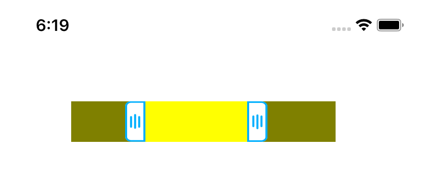
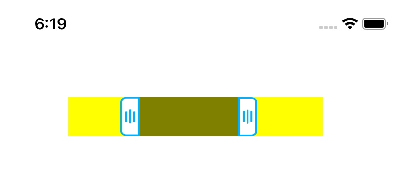

# YRRangePicker

[](https://travis-ci.org/Yuri/YRRangePicker)
[](https://cocoapods.org/pods/YRRangePicker)
[](https://cocoapods.org/pods/YRRangePicker)
[](https://cocoapods.org/pods/YRRangePicker)

## 说明

音视频编辑常用的音轨、画轨上区间选择器。
1. 操作灵敏，触点和定位无偏移
2. 支持选择中间、选择两边
3. 支持设置两端图标
4. 返回最小和最大区域的百分比

## 示例代码

克隆代码。在example project，执行 `pod install`

选择中间区域:



选择两端区域：



## 集成

YRRangePicker is available through [CocoaPods](https://cocoapods.org). To install
it, simply add the following line to your Podfile:

```ruby
pod 'YRRangePicker'
```
## 使用

在需要的地方编码：
```
let picker = YRRangePicker.init(pickType: .outside, frame: CGRect.init(x: 50, y: 100, width: 300, height: 40))
picker.didUpdateRange = { min,max in
    print("min:\(min) , max:\(max)")
}
view.addSubview(picker)
```

## Author

Yuri, xueyongwei@foxmail.com

## License

YRRangePicker is available under the MIT license. See the LICENSE file for more info.
